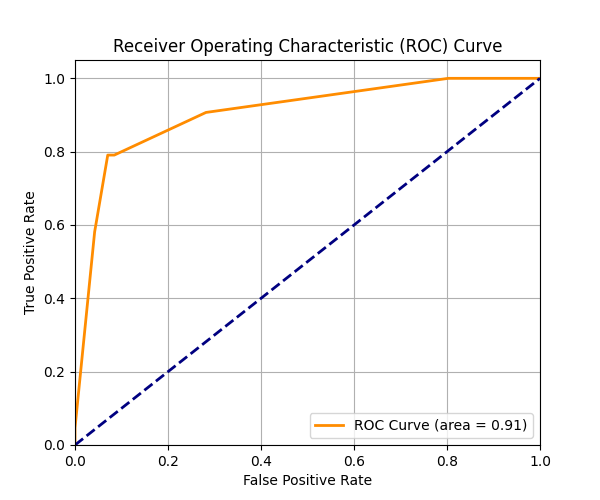

# Breast Cancer Diagnosis

A machine learning model to classify breast cancer tumors as benign or malignant using Random Forest, with interpretability provided by LIME (Local Interpretable Model-Agnostic Explanations).

## 🔍 Overview
This project applies a Random Forest Classifier on the Breast Cancer Wisconsin (Diagnostic) Dataset to predict whether a tumor is malignant or benign.  
A LIME explanation is included to interpret the model's prediction on individual test cases.

## 📂 Files
- `model_rf.py`: Main Python script for data loading, preprocessing, model training, evaluation, and visualization.
- `data.csv`: Dataset (from Kaggle or UCI link provided).
- `lime_explanation.html`: LIME visualization of how the model explains a single prediction.
- `breast_cancer_preprocessing_summary.md`: Step-by-step preprocessing summary.

## 📊 Dataset Source
[Breast Cancer Wisconsin (Diagnostic) Data Set](https://www.kaggle.com/datasets/uciml/breast-cancer-wisconsin-data)

## 📦 Requirements
```bash
- Python 3.8+
- Libraries:
    - pandas
    - numpy
    - scikit-learn
    - matplotlib
    - seaborn
    - lime
    - joblib
````

## 🚀 Run

```bash
python model_rf.py
```

If you want to visualize model interpretability using LIME:

* After running the script, open the file `lime_explanation.html` in your browser to explore the explanation for one test sample.

## ✅ Sample Output

```bash
Accuracy: 0.96

Classification Report:
              precision    recall  f1-score   support

           0       0.96      0.98      0.97        71
           1       0.96      0.92      0.94        43

    accuracy                           0.96       114
   macro avg       0.96      0.95      0.95       114
weighted avg       0.96      0.96      0.96       114

Confusion Matrix:
[[70  1]
 [ 3 40]]
```

## 📈 Visualizations

The script also provides the following visualizations:

### 🔹 Confusion Matrix

Displays the number of correct and incorrect predictions, segmented by class (Benign vs. Malignant).


### 🔹 Feature Importance Plot

Shows the most influential features for predicting the diagnosis:

* Features like `radius_mean`, `texture_mean`, etc. are displayed with their importance scores.
  

### 🔹 ROC Curve

Illustrates the model's performance across different classification thresholds, showing the trade-off between True Positive Rate (Sensitivity) and False Positive Rate (1 - Specificity).


---

## 💡 LIME Explanation (Model Interpretability)

We use [LIME (Local Interpretable Model-Agnostic Explanations)](https://github.com/marcotcr/lime) to explain **why** the model predicted a particular test sample as benign or malignant.

After running `model_rf.py`, the explanation for one test sample is saved as:

* 🔗 [`lime_explanation.html`]([https://htmlpreview.github.io/?https://github.com/MahsaFarnia23/breast_cancer_diagnosis/blob/main/lime_explanation.html]
* (https://htmlpreview.github.io/?https://github.com/MahsaFarnia23/breast_cancer_diagnosis/blob/main/lime_explanation.html
)
[lime_explanation]([https://breastcancerdiagnosis-xwiskh48x4ynp8s2ssenc2.streamlit.app/](https://htmlpreview.github.io/?https://github.com/MahsaFarnia23/breast_cancer_diagnosis/blob/main/lime_explanation.html
)
This interactive visualization highlights the **top 10 features** that influenced the model's decision, including:

* Which features pushed the prediction toward malignant
* Which ones pushed toward benign
* Their corresponding importance weights

Example:

```
Feature                             Contribution
----------------------------------------------
radius_mean > 14.5                  +0.42
concavity_mean > 0.2                +0.30
smoothness_mean < 0.08              -0.25
```

---

## 🌐 Breast Cancer Diagnosis Live App

This is a Streamlit web app that uses a Random Forest Classifier to predict whether a breast tumor is benign or malignant.
You can try the app online here:

👉 [https://breastcancerdiagnosis](https://breastcancerdiagnosis-xwiskh48x4ynp8s2ssenc2.streamlit.app/)

## 📜 License

This project is licensed under the MIT License - see the [LICENSE](LICENSE) file for details.


